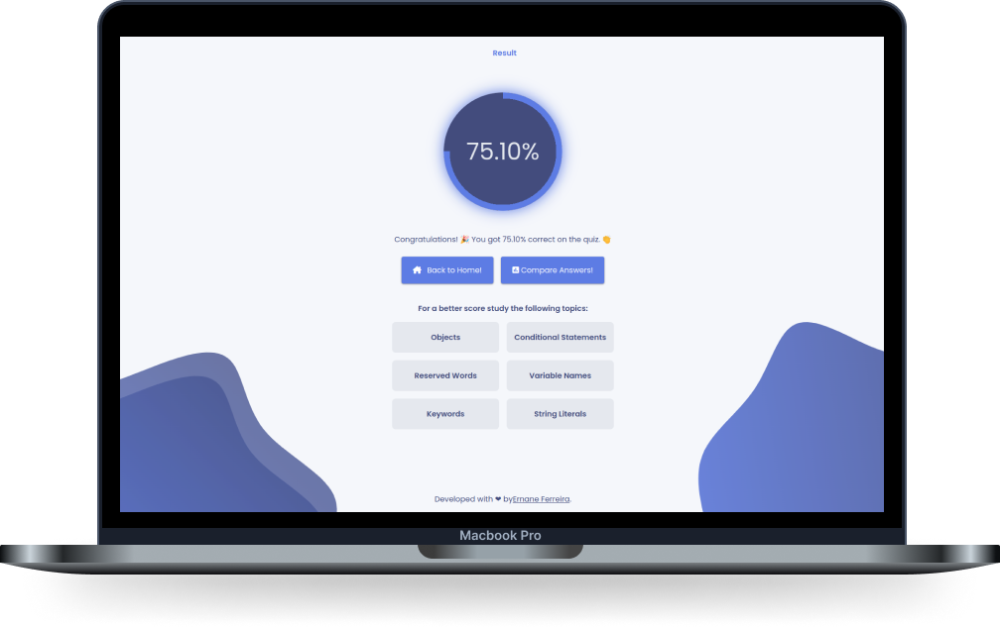

<h1 align="center">
   
</h1>

<div align="center">
  <a rel="noopener" href="#-Tecnologias">Tecnologias</a>&nbsp;&nbsp;&nbsp;|&nbsp;&nbsp;&nbsp;
  <a rel="noopener" href="#-Projeto">Projeto</a>&nbsp;&nbsp;&nbsp;|&nbsp;&nbsp;&nbsp;
  <a rel="noopener" href="#-Acesse">Acesse</a>&nbsp;&nbsp;&nbsp;|&nbsp;&nbsp;&nbsp;
  <a rel="noopener" href="#-Use">Use</a>&nbsp;&nbsp;&nbsp;|&nbsp;&nbsp;&nbsp;
  <a rel="noopener" href="#-Contribua">Contribua</a>&nbsp;&nbsp;&nbsp;
</div>

<br>

<p align="center">
  <p align="center">
  
</p>

</p>

## 🚀 Tecnologias

Esta aplicação foi desenvolvida com as seguintes tecnologias:

- JavaScript
- Svelte (SvelteKit)

## 💻 Projeto

Aplicação de centralização de questionários criado primordialmente para exercício do [SveltKit](https://kit.svelte.dev/). Com o intuito de faciliar primeiramente a execução do exame de competência para [certificação em Ruby prata ou bronze](https://www.ruby.or.jp/en/certification/examination/) o mesmo foi expandido para aceitar qualquer tipo de questionário.

### 📁 Features
- [x] Possibilidade de acessar multiplos questionários;
- [x] Questões com multiplas alternativas;
- [x] Persistência de dados a partir do localStorage do usuário:
- [x] Calculo percentual da quantidade de acerto;
- [x] Mostragem de tópicos a serem estudados para melhoria da pontuação;
- [x] Possibilidade de comparar respostas com um gabarito interativo;
- [x] Mostragem de uma breve explicação motivando a resposta correta;

## 💻 Acesse
<a target="_blank" rel="noopener" href="https://dev-quiz-app.netlify.app/">Clique aqui</a> para acessar a aplicação.

## 💡 Use

- Clone este repositorio:

```bash
$ git clone [git@github.com:ErnaneJ/devQuiz.git](https://github.com/ErnaneJ/devQuiz.git)
```

- Instale todas as dependências:

```bash
$ npm install
```
- Inicie a aplicação:

```bash
$ npm run dev
```

## ⚙️ Contribua

Essa aplicação possui um potêncial para crescer ainda mais. Portanto, abaixo listarei algumas features possíveis de serem implementadas que seriam benéficas para o projeto. Se você desejar implementar ou melhorar alguma feature fique à vontade para enviar uma solicitacao de pull. Irei adorar receber!

📁 Possíveis Features:

  - [ ] Implementação de modos de execução, livre ou com temporizador;
  - [ ] Implementação de uma análise gráfica do resultado a partir de um tempo de execução linear do resultado;
  - [ ] Possível melhoria na interface com criação de landding page para o projeto;
  - [ ] Criação de API para o projeto contando com um simples CRUD dos questionários;
  - [ ] ....
  
Além disso, o estado atual do APP é consumir os dados de questionários em [JSON](https://www.json.org/json-en.html) presentes na pasta [content]([/content](https://github.com/ErnaneJ/devQuiz/tree/master/content)). Sinta-se a vontade para adicionar algum questionário, seguindo o [modelo de exemplo](https://github.com/ErnaneJ/devQuiz/blob/master/example.json).

---

<div align="center">
  Desenvolvido com ❤ por <a target="_blank" rel="noopener" href="https://www.ernane.dev/">Ernane Ferreira</a>. 👋🏻<br/> Insentivado e idealizado por <a target="_blank" rel="noopener" href="https://www.seguroviagem.srv.br/">Real Seguro Viagem</a>. 💜
</div>
